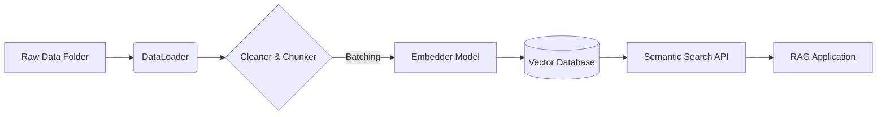

# vectorDBpipe

[](https://badge.fury.io/py/vectordbpipe)
[](https://www.python.org/downloads/)
[](https://opensource.org/licenses/MIT)

[](https://www.pinecone.io/)
[](https://www.trychroma.com/)
[](https://huggingface.co/)
[](https://github.com/facebookresearch/faiss)

**A Modular, End-to-End RAG Pipeline for Production-Ready Vector Search.**

`vectorDBpipe` is a robust framework designed to automate the heavy lifting of building RAG (Retrieval-Augmented Generation) systems. It seamlessly handles **data ingestion**, **text cleaning**, **semantic embedding**, and **storage** in modern vector databases.

---

## 🎯 Project Objectives

Building a vector search system often involves writing the same "glue code" over and over again:
1.  Parsing PDFs, Word docs, and Text files.
2.  Cleaning funny characters and whitespace.
3.  Chunking long text so it fits into context windows.
4.  Batching embeddings to avoid OOM (Out-of-Memory) errors.
5.  Creating and managing database indexes.

**`vectorDBpipe` solves this.** It is a "download-and-go" architected solution that reduces weeks of boilerplate work into a standardized `config.yaml` file.

**Ideal for:**
*   AI Engineers building internal RAG tools.
*   Developers needing to "chat with their data" instantly.
*   Researchers testing different embedding models or databases (switch from Chroma to Pinecone in 1 line).

---

## 🖥️ Terminal UI (New!)
**Prefer a visual interface?** We now have a futuristic Terminal User Interface (TUI) to manage your pipelines interactively.


### Installation
The TUI is a separate Node.js package that controls this Python backend.

```bash
npm install -g vectordbpipe-tui
```

### Features
*   **Interactive Setup Wizard**: `vdb setup`
*   **Visual Dashboard**: `vdb start`
*   **Connector Manager**: `vdb connectors` (Manage S3, Notion, etc.)

---

## 📦 Installation

### Standard Installation
Install the package directly from PyPI:

```bash
pip install vectordbpipe
```

### 🔧 CPU-Optimized Installation (Windows/No-CUDA)
If you encounter `WinError 1114` or DLL initialization errors with Torch, or if you run on a machine without a GPU, use the CPU-specific requirements:

1.  Download the `requirements-cpu.txt` from the repo (or create one with `torch --index-url https://download.pytorch.org/whl/cpu`).
2.  Run:
    ```bash
    pip install -r requirements-cpu.txt
    pip install vectordbpipe --no-deps
    ```

---

## ⚙️ Configuration Guide (`config.yaml`)

Control your entire pipeline via a `config.yaml` file. You can place this in your project root or pass the path explicitly.

```yaml
# ---------------------------------------------------------
# 1. CORE PATHS
# ---------------------------------------------------------
paths:
  data_dir: "data/"             # Folder containing your .pdf, .txt, .docx, .html files
  logs_dir: "logs/"             # Where to save execution logs

# ---------------------------------------------------------
# 2. EMBEDDING MODEL
# ---------------------------------------------------------
model:
  # HuggingFace Model ID (or OpenAI model name if provider is set)
  name: "sentence-transformers/all-MiniLM-L6-v2" 
  batch_size: 32                # Number of chunks to embed at once (Higher = Faster, more RAM)

# ---------------------------------------------------------
# 3. VECTOR DATABASE
# ---------------------------------------------------------
vector_db:
  type: "pinecone"              # Options: "chroma", "pinecone", "faiss"
  
  # For Pinecone:
  index_name: "my-knowledge-base"
  environment: "us-east-1"      # (Optional for serverless)
  
  # For ChromaDB (Local):
  # type: "chroma"
  # persist_directory: "data/chroma_store"

# ---------------------------------------------------------
# 4. LLM CONFIGURATION (Optional - for RAG generation)
# ---------------------------------------------------------
llm:
  provider: "OpenAI"            # Options: "OpenAI", "Gemini", "Groq", "Anthropic"
  model_name: "gpt-4-turbo"
```

---

## 🔐 Authentication & Security

Do **NOT** hardcode API keys in `config.yaml` or your code. `vectorDBpipe` automatically detects environment variables.

### Supported Environment Variables:

| Provider | Variable Name | Description |
| :--- | :--- | :--- |
| **Pinecone** | `PINECONE_API_KEY` | Required if `vector_db.type` is `pinecone`. |
| **OpenAI** | `OPENAI_API_KEY` | Required for OpenAI Embeddings or LLM. |
| **Gemini** | `GOOGLE_API_KEY` | Required for Google Gemini models. |
| **Groq** | `GROQ_API_KEY` | Required for Llama 3 via Groq. |
| **HuggingFace**| `HF_TOKEN` | (Optional) For gated models. |

### Setting Keys (Terminal):

**Linux/Mac:**
```bash
export PINECONE_API_KEY="pc-sk-..."
```

**Windows PowerShell:**
```powershell
$env:PINECONE_API_KEY="pc-sk-..."
```

**Python (.env file):**
Create a `.env` file in your root and use `python-dotenv`:
```python
from dotenv import load_dotenv
load_dotenv()
```

---

## 🚀 Usage 

### 1. Ingest Data (The "Magic" Step)
This script detects all files in your `data/` folder, cleans them, chunks them, embeds them, and uploads them to your DB.

```python
from vectorDBpipe.pipeline.text_pipeline import TextPipeline

# Initialize (Automatically loads config.yaml if present)
pipeline = TextPipeline()

# Run the ETL process
# batch_size=100 means it uploads to DB every 100 chunks to verify progress
pipeline.process(batch_size=100)

print("✅ Ingestion Complete!")
```

### 2. Semantic Search
Query your database to find relevant context.

```python
from vectorDBpipe.pipeline.text_pipeline import TextPipeline

pipeline = TextPipeline()

query = "What is the refund policy?"
results = pipeline.search(query, top_k=3)

print("--- Search Results ---")
for match in results:
    print(f"📄 Source: {match.get('metadata', {}).get('source', 'Unknown')}")
    print(f"📝 Text: {match.get('metadata', {}).get('text', '')[:200]}...")
    print(f"⭐ Score: {match.get('score', 0):.4f}\n")
```

---

## 🧠 Features & Architecture

### Supported File Types
*   **PDF** (`.pdf`): Extracts text using `PyMuPDF` (fitz).
*   **Word** (`.docx`): Parsing via `python-docx`.
*   **Text** (`.txt`, `.md`): Raw text ingestion.
*   **HTML** (`.html`): Strips tags using `BeautifulSoup`.

### Smart Chunking
Instead of naive splitting, `vectorDBpipe` uses a **Recursive Character Text Splitter**:
*   **Chunk Size**: 512 tokens (default, configurable).
*   **Overlap**: 50 tokens (preserves context between chunks).
*   **Separators**: Splits by Paragraph `\n\n`, then Line `\n`, then Sentence `. `, ensuring chunks are semantically complete.

### Architecture Flow


---

## 🔧 Troubleshooting

### `WinError 1114: A dynamic link library (DLL) initialization routine failed`
*   **Cause**: This usually happens on Windows when trying to run PyTorch (bundled with `sentence-transformers`) on a machine without a breakdown of CUDA libraries, or conflicting `intel-openmp` versions.
*   **Fix**:
    1.  Uninstall torch: `pip uninstall torch`
    2.  Install CPU version: `pip install torch --index-url https://download.pytorch.org/whl/cpu`

### `ModuleNotFoundError: No module named 'vectorDBpipe'`
*   **Cause**: You might be running the script outside the virtual environment or the package isn't installed.
*   **Fix**: Ensure `pip install vectordbpipe` succeeded.

---

## 🤝 Contributing

We welcome issues and PRs!
*   **Report Bugs**: Create an issue on GitHub.
*   **Roadmap**: Support for `Qdrant` and `Weaviate` is coming in v0.2.0.

**Author**: Yash Desai  
**License**: MIT
