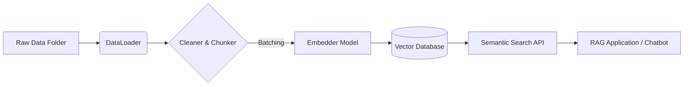

# 🚀 vectorDBpipe

[](https://badge.fury.io/py/vectordbpipe)
[](https://www.python.org/downloads/)
[](https://opensource.org/licenses/MIT)

[](https://www.pinecone.io/)
[](https://www.trychroma.com/)
[](https://huggingface.co/)
[](https://github.com/facebookresearch/faiss)

**A Modular, End-to-End RAG Pipeline for Production-Ready Vector Search.**

`vectorDBpipe` is a robust framework designed to automate the heavy lifting of building RAG (Retrieval-Augmented Generation) systems. It seamlessly handles **data ingestion**, **text cleaning**, **semantic embedding**, and **storage** in modern vector databases.

---

## 🎯 Project Objectives

Building a vector search system often involves writing the same "glue code" over and over again:
1. Parsing PDFs, Word docs, and Text files.
2. Cleaning funny characters and whitespace.
3. Chunking long text so it fits into context windows.
4. Batching embeddings to avoid OOM (Out-of-Memory) errors.
5. Creating and managing database indexes.

**`vectorDBpipe` solves this.** It is a "download-and-go" architected solution that reduces weeks of boilerplate work into a standardized `config.yaml` file.

**Ideal for:**
*   AI Engineers building internal RAG tools.
*   Developers needing to "chat with their data" instantly.
*   Researchers testing different embedding models or databases (switch from Chroma to Pinecone in 1 line).

---

## 🛠️ Tech Stack & Architecture

This project utilizes best-in-class open-source technologies:

*   **Ingestion**: `PyMuPDF` (PDF), `python-docx` (DOCX), `pandas` (CSV), `BeautifulSoup` (HTML).
*   **Vectorization**: `sentence-transformers` (HuggingFace compatible).
*   **Vector Database**: 
    *   **ChromaDB** (Local, persistent, file-based).
    *   **Pinecone** (Serverless, Cloud-native v3.0+).
    *   **FAISS** (Via underlying libraries or custom adapters).
*   **Orchestration**: Custom batch-processing Pipeline.

### 🏗️ Architecture Flow



---

## 💡 Use Cases

### 1. Enterprise Knowledge Base
Company wikis, PDFs, and policy documents are scattered.
*   **Solution**: Point `vectorDBpipe` to the shared drive. It indexes 10,000+ docs into Pinecone.
*   **Result**: Employees get instant, semantic answers ("What is the travel policy?") instead of keyword search.

### 2. Legal / Medical Document Search
Long documents need to be split intelligently.
*   **Solution**: Use the standardized chunker (e.g., 512 tokens with overlap).
*   **Result**: Retrieval finds the *exact paragraph* containing the clause or diagnosis.

### 3. Rapid Prototype for RAG
You have a hackathon idea but don't want to spend 4 hours setting up FAISS.
*   **Solution**: `pip install vectordbpipe` -> `pipeline.run()`.
*   **Result**: Working MVP in 5 minutes.

---

## 📦 Installation

Install the package directly from PyPI:

```bash
pip install vectordbpipe
```

### 🔧 Windows Users (DLL Error Constraints)
If you encounter `WinError 1114` or DLL initialization errors with Torch, install the CPU-optimized binaries:

```bash
pip install -r requirements-cpu.txt
```
*(This forces `intel-openmp` and CPU-only libraries to ensure stability on non-CUDA machines).*

---

## ⚙️ Configuration

Control your entire pipeline via `config.yaml`. No need to touch the code.

```yaml
# vectorDBpipe/config/config.yaml

paths:
  data_dir: "data/"  # Folder containing your .pdf, .txt, .docx files

model:
  name: "sentence-transformers/all-MiniLM-L6-v2" # Any HF model
  batch_size: 32

vector_db:
  type: "pinecone"   # Options: "chroma" or "pinecone"
  index_name: "my-knowledge-base"
  # For Chroma, use:
  # persist_directory: "data/chroma_store"
```

### 🔐 Credentials

Do NOT hardcode API keys. The system looks for environment variables:

**Linux/Mac:**
```bash
export PINECONE_API_KEY="your-secret-key"
```

**Windows PowerShell:**
```powershell
$env:PINECONE_API_KEY="your-secret-key"
```

---

## 🚀 Step-by-Step Demo: The "10-Line" RAG Pipeline

This script detects all files in your `data/` folder, processes them in memory-safe batches, and makes them searchable.

```python
from vectorDBpipe.pipeline.text_pipeline import TextPipeline

# ---------------------------------------------------------
# STEP 1: Initialize Pipeline
# ---------------------------------------------------------
# Reads config.yaml, sets up logging, connects to DB (Pinecone/Chroma)
pipeline = TextPipeline()

# ---------------------------------------------------------
# STEP 2: Ingest Data (The "Magic" Step)
# ---------------------------------------------------------
# Loops through all files in 'data_dir', cleans text, splits into 
# 512-token chunks, embeds them using HuggingFace model, 
# and uploads to DB in batches of 100 to save RAM.
pipeline.process(batch_size=100)

# ---------------------------------------------------------
# STEP 3: Semantic Search
# ---------------------------------------------------------
query = "How does vectorDBpipe reduce workload?"
results = pipeline.search(query, top_k=3)

print("--- Search Results ---")
for match in results:
    # Metadata contains the original text chunk and source file name
    print(f"Source: {match.get('metadata', {}).get('source', 'unknown')}")
    print(f"Content: {match.get('metadata', {}).get('text', '')[:200]}...\n")
```

---

## 🧠 Deep Dive: How It Reduces Work

### Before `vectorDBpipe` vs. After

| Feature | The "Hard Way" (Manual) | The `vectorDBpipe` Way |
| :--- | :--- | :--- |
| **PDF Parsing** | Write `fitz` loops, handle exceptions, merge pages. | `loader.load_data()` handles PDF, DOCX, TXT, HTML auto-magically. |
| **Chunking** | Write regex wrappers, handle overlaps, off-by-one errors. | `chunk_text(text, chunk_size=512)` built-in utility. |
| **Embeddings** | Manually loop `model.encode()`, manage tensors. | `Embedder` class abstracts this away (Mock fallback included). |
| **Scalability** | "Out of Memory" when loading 1000 PDFs. | **Batch Processing** built-in. Flushes data every 100 chunks. |
| **DB Switching** | Rewrite insert logic for Pinecone connection vs Chroma. | Change `type: pinecone` in YAML. Done. |

### Code Snippet: Scalable Batch Processing
Use the new **`process(batch_size=N)`** method introduced in v0.1.3 to handle massive datasets.

```python
# Even if you have 10GB of text files, this won't crash your RAM.
pipeline.process(batch_size=50) 
```

---

## 📁 Project Structure

```bash
vectorDBpipe/
├── config/             # YAML configuration
├── data/               # Drop your raw files here
├── vectorDBpipe/
│   ├── data/           # Loader logic (PDF/DOCX/TXT parsers)
│   ├── embeddings/     # SentenceTransformer wrapper
│   ├── pipeline/       # The "Brain" (Process & Search flow)
│   └── vectordb/       # Store adapters (Chroma/Pinecone)
└── requirements.txt    # Production deps
```

---

## 🤝 Contributing

We welcome issues and PRs!
*   **Report Bugs**: Create an issue on GitHub.
*   **Updates**: We are working on adding `Qdrant` and `Weaviate` support in v0.2.0.

**Author**: Yash Desai  
**License**: MIT
